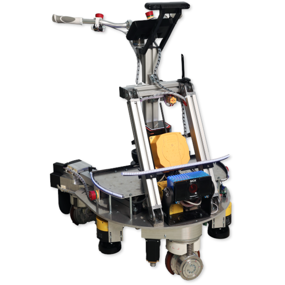

# Robotrainer - Wiki

This repository is intended to be a wiki for the Robotrainer of the IRAS at the University of Applied Sciences in Karlsruhe.

Robotrainer is a robot for a neuromuscular training. It's a three wheeled walker with motorized, omni- directional drive-steer modules.

## Application overview
1. Normal walking with adaptive controller
2. Inverted steering
3. Disturbance forces with spatial control actions

## Quickstart

- [Quickstart](docs/Quickstart.md)
- [Shortcuts](docs/Shortcuts.md)

## How To RoboTrainer

- [How to start](docs/How_to_start.md)
- [General useful commands](/docs/Bringup_1.md)
- [Push a repo to GitHub](/docs/Git_Sync_1.md)
- [IPs and passwords](/docs/IPs_and_Passwords_1.md)

## Applications

-

## Components

- [Controllers](/docs/Controllers_1.md)
- [Laserscanner](/docs/Laserscanner_1.md)

## Troubleshooting

- 

## MS Teams

[RoboTrainer Team](https://hskarlsruhede.sharepoint.com/:f:/t/RoboTrainer/EsiCfV06BGpJitmgvy-oqk4Bn9q0lgA7ABGk0bIJfQHtZQ?e=a6dlWu)

If you are not yet part of the RoboTrainer team, you can ask any member of the IRAS Institute to invite you to join the team.

